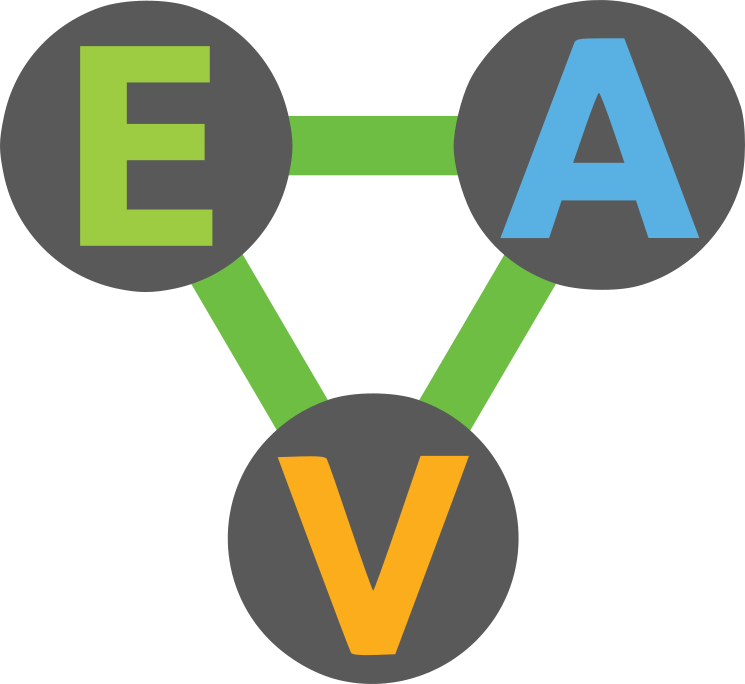

<!-- toc -->

- [What is Eva?](#what-is-eva)
  * [Getting Started](#getting-started)
- [Development](#development)
  * [Required Tools](#required-tools)
  * [Example: Hello World](#example-hello-world)
  * [Project Structure](#project-structure)
  * [Development Tasks](#development-tasks)
    + [Running the Test Suite](#running-the-test-suite)
- [Configuration](#configuration)
- [About the Eva Data Model](#about-the-eva-data-model)
  * [Entity-Attribute-Value (EAV)](#entity-attribute-value-eav)
  * [Time-Aware](#time-aware)
  * [Accumulative](#accumulative)
  * [Atomic Consistency](#atomic-consistency)
    + [Transactions](#transactions)
      - [Using Object/Map form in transactions](#using-objectmap-form-in-transactions)
  * [Schemas](#schemas)
    + [Defining the schema for `:attribute1`:](#defining-the-schema-for-attribute1)
- [Components](#components)
- [Running with Docker](#running-with-docker)
- [Additional Resources](#additional-resources)
  * [FAQ](#faq)
    + [Is this project or Workiva in any way affiliated with Cognitect?](#is-this-project-or-workiva-in-any-way-affiliated-with-cognitect)
    + [Should I use Eva instead of Datomic?](#should-i-use-eva-instead-of-datomic)
    + [What are the key differences between Eva and Datomic?](#what-are-the-key-differences-between-eva-and-datomic)
    + [Why did Workiva build Eva?](#why-did-workiva-build-eva)
    + [Why is Workiva open sourcing Eva?](#why-is-workiva-open-sourcing-eva)
    + [What will Workiva's ongoing contributions to Eva be?](#what-will-workivas-ongoing-contributions-to-eva-be)
  * [Maintainers and Contributors](#maintainers-and-contributors)
    + [Active Maintainers](#active-maintainers)
    + [Previous Contributors](#previous-contributors)

<!-- tocstop -->

# What is Eva?
Eva is a distributed database-system implementing an entity-attribute-value data-model
that is *time-aware*, *accumulative*, and *atomically consistent*. Its API is
by-and-large compatible with Datomic's. This software should be considered *alpha*
for the purposes of quality and stability. Check out the [FAQ](#faq) for more info.

## Getting Started
If you are *brand new* to Eva, we suggest reading through this **entire** readme to familiarize yourself with Eva as a whole.  Afterwards, be sure to check out the Eva tutorial series, which break down and go over almost everything you will want to know.
* [Eva 101](docs/eva_101.md)
* [Eva 102](docs/eva_102.md)

# Development
## Required Tools
1. [Java Development Kit (JDK) v8](http://www.oracle.com/technetwork/java/javase/downloads/jdk8-downloads-2133151.html)
2. [Leiningen Build Tool](http://leiningen.org)

## Example: Hello World
First we kick off the repl with:
```
lein repl
```

Next we create a connection (`conn`) to an in-memory Eva database.  We also need to define the fact (`datom`) we want to add to Eva. Finally we use the `transact` call to add the fact into the system.
```clj
(def conn (eva/connect {:local true}))
(def datom [:db/add (eva/tempid :db.part/user)
            :db/doc "hello world"])
(deref (eva/transact conn [datom]))
```

*Note: [deref](https://clojuredocs.org/clojure.core/deref) can be used interchangeably with the @ symbol.*

Now we can run a query to get this fact out of Eva.  We don't use `conn` to make a query but rather we obtain an immutable database value like so:
```clj
(def db (eva/db conn))
```

Next we execute a query that returns all entity ids in the system matching the doc string `"hello world"`.
```clj
(eva/q '[:find ?e :where [?e :db/doc "hello world"]] db)
```

If we want to return the full representation of these entities, we can do that by adding `pull` to our query.
```clj
(eva/q '[:find (pull ?e [*]) :where [?e :db/doc "hello world"]] db)
```

## Project Structure
1. `project.clj` contains the project build configuration
2. `core/*` primary releasable codebase for Eva Transactor and Peer-library
    1. `core/src` clojure source files
    2. `core/java-src` java source files
    3. `core/test` test source files
    4. `core/resources` non-source files
3. `dev/*` codebase used during development, but not released
    1. `dev/src` clojure source files
    2. `dev/java-src` java source files
    3. `dev/test` test source files
    4. `dev/resources` non-source files
    5. `dev/test-resources` non-source files used to support integration testing

## Development Tasks
### Running the Test Suite
```
lein test
```

# Configuration
Eva exposes a number of configuration-properties that can be configured
using java system-properties. Some specific configuration-properties can
also be configured using environment-variables.

The `eva.config` namespace, linked [here](core/src/eva/config.clj), contains
descriptions and default values for the config vars.

# About the Eva Data Model
## Entity-Attribute-Value (EAV)
EAV data-entities consist of:
 1. a distinct entity-id
 2. 1-or-more attribute-value pairs associated with a single entity-id

 EAV data can be represented in the following (equivalent) forms:
 1. as an object or map:
    ```clojure
    {:db/id 12345,
     :attribute1 "value1",
     :attribute2 "value2"}
    ```
 2. as a list of EAV tuples:
    ```clojure
    [
      [12345, :attribute1, "value1"],
      [12345, :attribute2, "value2"]
    ]
    ```

## Time-Aware
To make the EAV data-model time-aware, we extend the EAV-tuple
into an EAVT-tuple containing the transaction-id (T) that introduced the tuple:
   ```clojure
   [
   ;;  E      A            V         T
      [12345, :attribute1, "value1", 500],
      [12345, :attribute2, "value2", 500]
   ]
   ```

## Accumulative
To make the EAVT data-model accumulative, we extend the EAVT-tuple
with a final flag that indicates if the EAV information was added or removed
at the transaction-id (T).

```clojure
[
;;  E      A            V         T    added?
   [12345, :attribute1, "value1", 500, true],
   [12345, :attribute2, "value2", 500, true]
]
```

Under this model, common data operations (create, update, delete) are represented like this:
- **Create:** a single tuple with `added? == true`
 ```clojure
 [[12345, :attribute1, "create entity 12345 with field :attribute1 at transaction 500", 500, true]]
 ```
- **Delete:** a single tuple with `added? == false`
 ```clojure
 [[12345, :attribute1, "create entity 12345 with field :attribute1 at transaction 500", 501, false]]
 ```
- **Update:** a pair of deletion and creation tuples
 ```clojure
 [
  ;; At transaction 502
  ;;   invalidate the old entry for :attribute2
       [12345, :attribute2, "old-value", 502, false]
  ;;   add a new entry for :attribute2
       [12345, :attribute2, "new-value", 502, true]
 ]
 ```

The *complete history* of the database is the cumulative list of these tuples.

## Atomic Consistency
Data-updates are submitted as transactions that are processed atomically.
This means that when you submit a transaction, either **all** the changes in
the transaction are applied, or **none** of the changes are applied.

### Transactions
Transactions are submitted as a *list of data-modification commands.*

The simplest data-modification commands (`:db/add`, `:db/retract`) correspond
to the accumulative tuples described above:
 ```clojure
 [
   [:db/retract 12345 :attribute2 "old-value"]
   [:db/add 12345 :attribute2 "new-value"]
 ]
 ```

When this transaction is committed it will produce the following tuples in the database history
(where `<next-tx>` is the next transaction-number):
 ```clojure
 [
   [12345, :attribute2, "old-value", <next-tx>, false]
   [12345, :attribute2, "new-value", <next-tx>, true]
 ]
 ```

#### Using Object/Map form in transactions
In addition to the command-form, you can also create/update data using the
object/map form of an entity:
```clojure
[
  {:db/id 12345
   :attribute1 "value1"
   :attribute2 "value2"}
]
```
This form is equivalent to the command-form:
 ```clojure
 [
   [:db/add 12345 :attribute1 "value1"]
   [:db/add 12345 :attribute2 "value2"]
 ]
 ```

## Schemas
Because all stored data reduces to EAVT tuples,
schemas are defined per *Attribute*, rather than per *Entity*.

Schemas definitions are simply Entities that have special *schema-attributes*.

### Defining the schema for `:attribute1`:
```clojure
[
  {:db/id #db/id[:db.part/db]
   :db/ident :attribute1
   :db/doc "Schema definition for attribute1"
   :db/valueType :db.type/string
   :db/cardinality :db.cardinality/one
   :db.install/_attribute :db.part/db}
]
```

Taking each key-value pair of the example in turn:
- `:db/id #db/id[:db.part/db]`: declares a **new entity-id** in the `:db.part/db` id-partition
- `:db/ident :attribute1`: declares that `:attribute1` is an alias for the entity-id
- `:db/doc "Schema definition for attribute1"`: human-readable string documenting the purpose of `:attribute1`
- `:db/valueType :db.type/string`: declares that only string values are allowed for `:attribute1`
- `:db/cardinality :db.cardinality/one`: declares that an entity may no-more-than *one* `:attribute1`.
   This means that for an given entity-id, there will only ever be *one* current tuple of `[<entit-id> :attribute1 <value>]`.
   Adding a new tuple with this attribute will cause any existing tuple to be removed.
- `:db.install/_attribute :db.part/db`: declares that this `:attribute1` is registered with the database as
   an *installed attribute*

# Components

* [Eva Catalog](http://github.com/Workiva/eva-catalog)
* [Eva Client Service](http://github.com/Workiva/eva-client-service)

# Running with Docker

The included [docker compose](./docker-compose.yml) can be used to spin up a completely integrated Eva environment.  This includes:

* transactor
* eva-catalog
* activemq
* [maria-db image](/docker/eva-db/)

To spin up said environment run the following commands:

```bash
make gen-docker-no-tests # to build Eva with the latest changes
make run-docker
```

To shut down the the environment use the following command:
```bash
make stop-docker
```

In order to open a repl container that can talk to the environment use:

```bash
make repl
```

And run the following to initially setup the repl environment:

```clj
(require '[eva.catalog.client.alpha.client :as catalog-client])
(def config (catalog-client/request-flat-config "http://eva-catalog:3000" "workiva" "eva-test-1" "test-db-1"))
(def conn (eva/connect config))
```

Finally, test that everything is working with an empty transaction:

```clj
(deref (eva/transact conn []))
```

A similar result to this should be expected:

```clj
{:tempids {}, :tx-data (#datom[4398046511105 15 #inst "2018-06-06T17:35:07.516-00:00" 4398046511105 true]), :db-before #DB[0], :db-after #DB[1]}
```


# Additional Resources
- [Additional Documentation](docs).
- The reference documentation at http://docs.datomic.com/ is highly relevant for development within Eva.
- http://www.learndatalogtoday.org/ is a great resource for learning Datalog, the underlying query language in Eva.
- https://github.com/kristianmandrup/datascript-tutorial is another great resource for learning Datalog and how it applies to Datomic (or Eva).

## FAQ

### Is this project or Workiva in any way affiliated with Cognitect?

No. Eva is its own project we built from the ground up. The API and high-level
architecture are largely compatible with Datomic, but the database, up to
some EPL code, was entirely built in-house. We have a list of the most
notable API differences [here](docs/differences.md).

### Should I use Eva instead of Datomic?

If you are looking for an easy system to move to production quicky, almost
certainly not. Eva is far less mature and has seen
far less time in battle. Datomic Cloud is an amazing (and *supported*) product
that is far easier to stand up and run with confidence. Eva is provided as-is.

### What are the key differences between Eva and Datomic?

There are a handful of small API differences in the Peer, whereas the Clients
are quite distinct. For example, a Connection in Eva is constructed using a
baroque configuration map, not a string. From an operational standpoint,
Datomic is far more turn-key. There are also likely some low-level
architectural differences between the systems that will cause them to
exhibit different run-time characteristics. For example, our indexes are
backed by a persistent B^𝜀-tree, whereas Datomic's indexes seem to exhibit
properties more like a persistent log-structured merge-tree. For a more detailed
list check [here](docs/differences.md).

### Why did Workiva build Eva?

Workiva's business model requires fine-grained and scalable
multi-tenancy with a degree of control and flexibility that fulfill our
own evolving and unique compliance requirements. Additionally, development
on Eva began before many powerful features of Datomic were released, including
Datomic Cloud and Datomic Client.

### Why is Workiva open sourcing Eva?

The project by-and-large is nearly feature complete and we believe is generally
technically sound. Workiva has decided to discontinue closed development on Eva,
but sees a great deal of potential value in opening the code base to the OSS
community. It is our hope that the community finds value in the project as a
whole.

### What will Workiva's ongoing contributions to Eva be?

Eva will likely still continue to be maintained and matured in 10% time and by
previous contributors on their personal time.

## Maintainers and Contributors

### Active Maintainers

- Erik Petersen <erik.petersen@workiva.com>

### Previous Contributors

Listed, in transaction log style, in order of addition to the project:

- Ryan Heimbuch <rheimbuch@gmail.com>
- Houston King <houston.king@workiva.com>
- Timothy Dean <galdre@gmail.com>
- Ross Hendrickson <ross.hendrickson@gmail.com>
- Erik Petersen <erik.petersen@workiva.com>
- Brandon St. Jules <brandon.stjules@workiva.com>
- Tyler Wilding <tyler.wilding@workiva.com>
- Daniel Harasymiw <daniel.harasymiw@workiva.com>
- Martin Kreibe <martin.kreibe@workiva.com>
- Alex Alegre <alex.alegre@workiva.com>
- Aleksandr Furmanov <aleksandr.furmanov@workiva.com>
