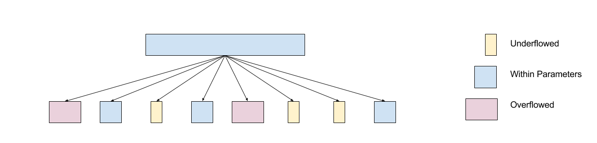
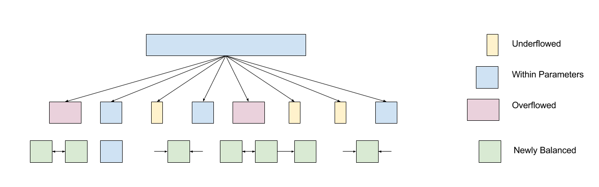
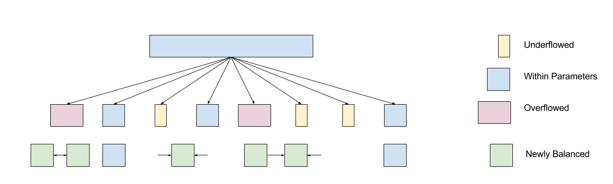

# Bε-Tree Balancing

This document describes the balancing technique we use in [Version 0 of the Bε-tree](../balance.clj).

When pushing updates down our btree, it sometimes becomes necessary to rebalance parts of the tree. This happens whenever any node (possibly internal to the tree) becomes either too large or too small. In a traditional b-tree, the situation is handled like so:

**Too small (underflowed):** We attempt to merge the offending node with one of its neighbors. However, if doing so would create a node that is too large, instead we simply borrow values from one of the neighboring nodes. The math works out such that we can always either merge or borrow.

**Too large (overflowed):** We split the node into two nodes.

In the canonical implementation of a mutable b-tree structure, one performs a single operation at a time on the tree, and so at any given level of the tree you have at most one balancing operation to contend with. However, in our Bε tree implementation, we may push down hundreds of updates at once, not all of which are destined for the same leaf node. Therefore it’s conceivable that we could run into a situation like this:

A simple and naive translation of the strategies above would involve passing left to right, resolving one at a time, until all the balancing is complete:

However, this may involve more than the optimal amount of work. Moreover, some of these operations potentially involve modifying nodes that did not need to be modified. This latter point is particularly important if touching these nodes requires expensive network requests. Much better is to consider all of the imbalanced nodes together, and perform operations that minimize the impact on nodes that don’t need to be rebalanced. This consideration leads us to prefer certain balancing operations over others. So we get modified strategies similar to these:

**Underflowed**: We attempt to merge the offending node with one of its neighbors, perhaps preferring another underflowed node, or another node that we’re planning on modifying anyway. However, if doing so would create a node that is too large, instead we simply borrow values from one of the neighboring nodes, preferably a node that has overflowed or that we are modifying anyway.

**Overflowed**: We prefer to let a neighboring underflowed node take some of this node’s children. If that is not possible, we split the node into two nodes.

Now this has become a multi-objective optimization problem, because each individual operation’s benefit depends on all of the other operations chosen. Another way of saying this is that we have to evaluate all of the operations as a group, rather than individually. So the problem lends itself well to dynamic programming or similar approaches.

Bε-trees have an additional complication; namely, that all of our nodes have buffers. If you combine two different nodes, the buffers may combine, then overflow, triggering a new recursive update process on that portion of the subtree. The results, from the perspective of the balancing algorithm, are unpredictable.

So our balancing algorithm temporarily ignores the existence of buffers, since much of the information regarding those buffers is not available without fetching nodes from storage unnecessarily. Instead, we move temporarily to a simplified search space where we only consider the sizes of the nodes in question. Then out of all the possible combinations of balancing operations, we search for the strategy that meets these three criteria, in precisely this order of priority:

1. Minimize the number of nodes “touched.”
2. Minimize the maximum size of any new nodes created (though we are “ignoring” buffers, this criterion reduces the chances that we trigger a buffer overflow right away)
3. Minimize the number of distinct balancing operations required.

Once our algorithm has discovered this strategy, control passes back to our regular update algorithm, which then executes the strategy on real nodes.
