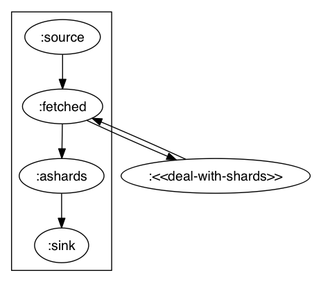
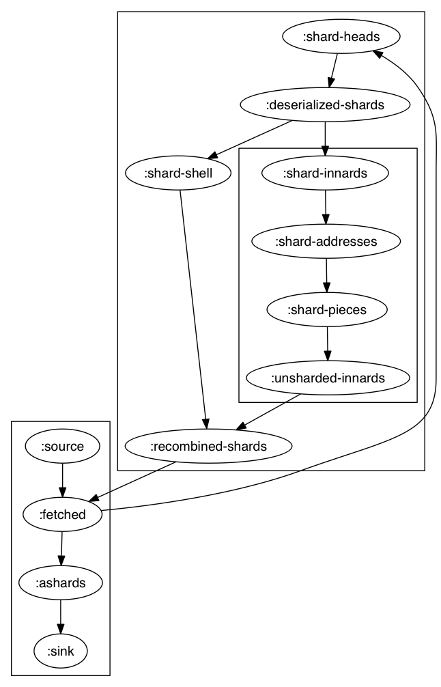
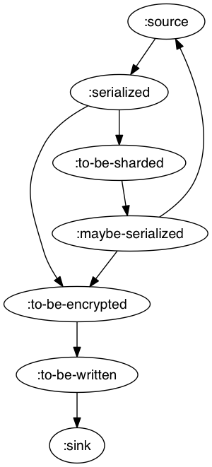

# Value Store

The **Value Store** is a key-value abstraction over the block store that exists to provide a higher level interface to our persistent storage; its form is determined partly by historical reasons of development.

The [interface](protocols.clj) consists of the following eight methods. See the [interface documentation](protocols.clj) for the associated contracts. All methods return promises.

 * **get-partition**
 * **get-value**
 * **get-values**
 * **put-value**
 * **put-values**
 * **remove-key**
 * **remove-keys**
 * **replace-value**

The values passed into the store may be any value, including arbitrary Java objects, so long as [fressian serializers and deserializers](https://github.com/clojure/data.fressian) are provided. When writing values, the value store serializes the values, (possibly) shards them, (possibly) encrypts them, and otherwise massages them into a form agreeable to the [Block Store](../core.clj), such that they can be read back out (via deserialization *etc.*) later.

## Configuration Parameters

When reading or writing multiple values, the value store packs as much as possible into each I/O call, up to `:eva.v2.storage.max-request-cardinality`, a paramater defined in the [global config file](../../../config.clj).

All I/O calls are given a timeout of `:eva.v2.storage.request-timeout-ms` milliseconds, again defined in the [global configuration map](../../../config.clj).

## Implementation Overview

Two implementations are provided: the ["simple" value store](gcached.clj) and the ["concurrent" value store](concurrent.clj). The simple is largely boring. An instance of the simple store is thread safe, and if multiple threads happen to use it at once, the operations will be performed in parallel; moreover, all the values in a single operation are serialized or deserialized in parallel (via Clojure's [`pmap`](https://clojuredocs.org/clojure.core/pmap)). However, beyond these simple optimizations, no attempt has been made to provide facilities of concurrent execution.

The concurrent value store, on the other hand, acts as a service, in the sense that all write operations are placed into one queue and all read operations are placed into another, and operations for each queue are handled serially; that is, no two writes and no two reads are processed at once. The tradeoff is that each operation is executed with a high degree of parallelism, and certain optimizations are made to limit I/O delays in the case of sharding.

We have performed no rigorous benchmarks, but early tests indicated that using the concurrent value store rather than the simple value store may make little to no difference to Eva's transactor, while roughly doubling the speed of the indexers.

Below are high-level explanations of how the concurrent value store works, enough (I hope) to make it easy to read the code and understand the details that here are left out.

## Concurrent Value Store: Reads

The basic operations for reading values out of the concurrent key store are as follows: First, the desired keys are requested from the underlying block store (possibly involving I/O); second, values that were returned as shard heads are resolved into their component shards and glued together; third, all resulting values are deserialized into the original values or objects. This sequence of operations may be visualized as the following graph:

The `:source` node initially contains the keys sought; the `:fetched` node will contain the values as stored in the block store; the `:ashards` node will contain all such values that are not in a sharded state; the `:sink` node in the end contains these values, deserialized. This is accomplished by means of a dedicated threadpool that moves items through this graph one at a time, in order accorded with edge priorities. The double arrow between `:fetched` and `:<<deal-with-shards>>` represents the complex set of operations that is de-sharding. These operations, up until I/O requesting component shards, are given the highest priority. The rationale is to minimize idling: by front-loading the necessary I/O as much as possible, we allow some deserialization steps to occur while waiting on shard I/O.

### Unsharding

The details of `:<<deal-with-shards>>` are shown in the following complete graph for the reader:

Shard heads are placed into `:shard-heads`. These are deserialized, into `:deserialized-shards`. Each of these values is duplicated, going to both `:shard-shell` and `:shard-innards` (the names are merely expository). The shard addresses stored in `:shard-innards` are extracted and placed into `:shard-addresses`, then these are requested from the block store (I/O) and placed into `:shard-pieces`, then these byte-strings are glued together and placed into `:unsharded-innards`. Every step from `:shard-innards` to `:unsharded-innards`, while executed in parallel, is tightly coordinated to ensure that no intermediate values get out of order.

Next the original block representation as stored in `:shard-shell` is paired with the newly calculated value stored in `:unsharded-innards`, with each pair being placed into `:recombined-shards`. This step is also tightly coordinated. Next the two values in each pair are recombined and placed back into `:fetched`, in exactly the same type of intermediate state as any value that had never been sharded.

## Concurrent Value Store: Writes

The data flow graph for writing is a bit simpler than that for reading, as there is only a single I/O step, at the end of the process. Nor do any edges in this graph require close coordination: all nodes will be written sooner or later, or the entire operation will be considered a failure.

All key-value pairs in an operation are initially placed into `:source`. All values are fully serialized (serialized, zipped). Resulting values which exceed the sharding threshold are placed into `:to-be-sharded`; all others are placed into `:to-be-encrypted`. Encrypted values are pushed into `:to-be-written`, which communicates with the block store, placing the succesfully written keys into `:sink`.

The values in `:to-be-sharded` are sharded, producing some number *n* of shard components (with newly-generated ids for storing in the block store), as well as a newly created shard 'head' whose value is merely a sequence of the component ids. These are all placed into `:maybe-serialized`, whose only purpose is to filter the already-serialized shard components back to `:to-be-encrypted`, and to send the newly-created shard head back up to `:source`.
