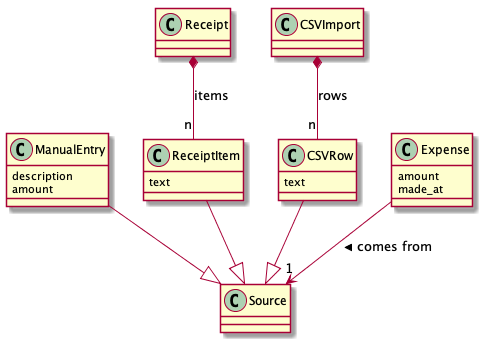
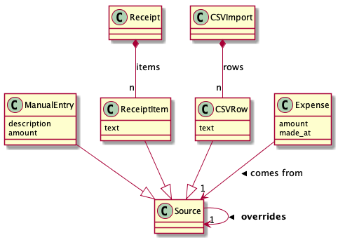

## Designing database schema in EVA vs SQL.

Probably the best way to demonstrate differences is on small simple
example:

Consider implementation of application for tracking personal expenses.
Information about expenses could come from different sources:

- Photos of receipts
- Daily CSV imports from bank account
- Manual entries for cash expenses when receipt is not available

Daily imports and receipt processing are not always guaranteed to
produce right data and user must be able to fix errors
by overriding original entries with manual ones.

Also user want to see monthly expenses report and must able to track
every entry back to its original source: such trace must include all
manual modifications if there were any.


### SQL version

Let's start with use cases one of which is the monthly report. We limit
it to just finding summary for simplicity. How SQL query finding summary will look like?
Probably somewhat like:

```SELECT SUM(amount) FROM expenses WHERE made_at BETWEEN '2018-01-01' AND '2018-02-01';```

where `expenses` table has schema:

  Column   | Type      |
-----------|-----------|
 id        | integer   |
 amount    | real      |
 made_at   | timestamp |

But this does not have any link to original source of expense, which in database terms is
a foreign key. There are three sources of expenses, does it mean there must be three
foreign keys? It is a one option, however there another more scalable way:
We could say that all three different types of input are some kind of "source" and
link expenses to their "sources":

`expenses`

  Column       |  Type      |
---------------|------------|
 id            | integer    |
 **source_id** | integer    |
 amount        | real    |
 made_at       | timestamp  |

`sources`

  Column   |            Type             |
-----------|-----------------------------|
 **id**    | integer                     |


In OO terms 'source' is a base class for inputs:




There are few ways to map hierarchy of classes `ManualEntry`, `ReceiptItem`, `CSVRow` and `Source`  into tables:
 1. Table per class hierarchy
 2. Table per subclass
 3. Table per concrete class

For our purposes it is not very important how mapping is done. The more interesting question
is how to address another requirement - how  user would be able to manually override
erroneous entries? Consider following scenario:

 1. User buys beer, scan receipt and new record in `expenses` gets created with amount $899 (OCR error)
 2. User detects an error and wants to manually override it with correct value $8.99.

In this scenario what kind of changes of `expenses` table need to be done? There are two possible choices:

 1. **UPDATE** invalid record with valid value
 2. **INSERT** new record with valid value

Here is the dilemma: Updating would erase history (and trace-ability requirement would not be met),
inserting new record would break monthly report. Let's try to not erase any data but rather come
up with way to interpret them correctly, i.e. let's try second approach. Then we have to do something
about query:

```SELECT SUM(amount) FROM expenses WHERE made_at BETWEEN '2018-01-01' AND '2018-02-01';```

since it would contain both values for same item: incorrect one - $899 and correct one -  $8.99

The way query has to be updated could be described as follows: get all expenses for January which *were not*
overridden and sum up their amounts. However data model is missing idea of
expenses being overridden. This could be fixed by adding "overrides" relation:



The schema for `sources` table:

  Column      |            Type             |
--------------|-----------------------------|
 id           | integer                     |
 overrides_id | integer                     |


and query would be somewhat like:

  ```
  SELECT SUM(amount) FROM expenses e JOIN sources s ON s.id = e.source_id
  AND NOT EXISTS (SELECT * FROM sources s2 WHERE s2.overrides_id = s.id)
  AND made_at BETWEEN '2018-01-01' AND '2018-02-01';
  ```

Now all historical changes could be captured and correct monthly reports generated.

*Note*: if another approach is chosen - **UPDATE**ing incorrect record vs **INSERT**ing new one
then in order to preserve history something should capture older record values, for example,
using table like the one below where version get bumped for every new entry:

`expenses_versions`

  Column        |  Type      |
----------------|------------|
 id             | integer    |
 expense_id     | integer    |
 version        | integer    |
 amount         | real    |
 made_at        | timestamp  |


### EVA version
We may think what facts we want to capture. Every fact is a triplet (actually
a 5-tuple, but more about it later):

- Entity
- Attribute
- Value

Besides simple types like `<Text>` and `<Time>` Value could be a
`<Reference>` which is a reference to another entity. Let's list
fact kinds:


  Entity          |  Attribute      | Value          |
------------------|-----------------|----------------|
  `<Reference>`   | is-on-receipt   |  `<Reference>` |
  `<Reference>`   | from-import     |  `<Reference>` |
  `<Reference>`   | made-at         |  `<Time>` |
  `<Reference>`   | has-text        |  `<Text>`      |
  `<Reference>`   | has-amount      |  `<Real>`      |
  `<Reference>`   | overrides       |  `<Reference>` |


Is it enough for capturing data we need? Let's check it:

Receipt item `Ref-1` could be described as combination of facts:

  Entity  | Attribute       |  Value      |
----------|-----------------|-------------|
  Ref-1   | is-on-receipt   |  Ref-2      |
  Ref-1   | has-text        |  "Beer $899"|
  Ref-1   | has-amount      |  899.0      |


CSV Row facts are pretty similar to Receipt Item ones

Manual Entry with id `Ref-3` could be modeled as:

  Entity  | Attribute       |  Value              |
----------|-----------------|---------------------|
  Ref-3   | overrides       |  Ref-1              |
  Ref-3   | has-text        |  "Fixes $899->$8.99"|
  Ref-3   | has-amount      |  8.99               |


Those let us capture data from three different inputs as well as information
about overriding invalid entries. Monthly report query is:

  ```
  [:find (sum ?amount) :where
  ?e :has-amount ?amount
  ?e :made-at ?t
  (in-range? ?t ['2018-01-01' '2018-02-01'])]
  ```

However, it has same problem as in SQL example - it would count both $899.0 and $8.99 even
latter overrides former. How to fix it? It is worth noting that EAVs triplets are
separate facts, they are not like columns in the same table which describe **same** entity,
rather they are more granular things which could be combined in any way.
What if we model manual update like this?

  Entity     | Attribute       |  Value              |
-------------|-----------------|---------------------|
  Ref-3      | overrides       |  Ref-1              |
  Ref-3      | has-text        |  "Fixes $899->$8.99"|
  **Ref-1**  | has-amount      |  8.99               |

(Note: Reference to manual update `Ref-3` has
been replaced with reference to receipt item `Ref-1`)
First fact captures information that user has overridden something.
The second is the description of user operation.
And third fact is new correct information about amount on receipt item. So when
all three facts get applied the older `[Ref-1  has-amount  899.0]` fact would be
replaced with newer fact `[Ref-1  has-amount  8.99]`.

Does not it look the same as **UPDATE**ing `expenses` row in SQL implementation?
Not really. With EVA  new fact `[Ref-1  has-amount  8.99]` does not erase
older fact `[Ref-1  has-amount  899.0]` but rather "shadows" it, i.e. older
becomes invisible but still could be retrieved. As we seen before -
SQL implementation might have support of record modifications history.
However inspecting such history for a single record might be not enough - sometimes we might want to
know what other data were when record has been updated in the past. If tracking history is
enabled for other tables then one could find their state by timestamp of modification. This is
not super easy though.

With EVA finding state of all facts in the past is rather trivial, every fact update
happens within transaction, transaction have ids and timestamps, and all fact assertions and
retractions are kept. So knowing transaction id is enough to get whole snapshot of the database.


### Comparison

There are few things to consider in examples above:

1. Reference to entity in SQL (foreign key) is more specific than
reference in EVA, since foreign key is at least **table** and
**column-name** and in our SQL example it led to finding common
ancestors for input sources and creating "sources" table. In EVA
references are polymorphic and do not have to "know" about types
of entities they referring to.

2. Entities could be modeled in EVA without defining their "types":
Rather their types could be deduced from context, i.e. from relations to other entities:
The information "X has a manager and X works in office"
is enough to figure out that X is both human and employee, without explicitly
defining "Human" type and inheriting "Employee" type from it.

3. The analog of relationship between entities in EVA is an attribute of Reference value type,
and not like in SQL it could be re-used:
In SQL if some other table would need column `made_at` it would be different column in different table while
in EVA existing `:made-at` attribute could point to any kind of entity, for example it could be reports, or emails.

4. Obvious one: Support of historical data and "traveling" in time is part of EVA while in SQL it require extra effort
